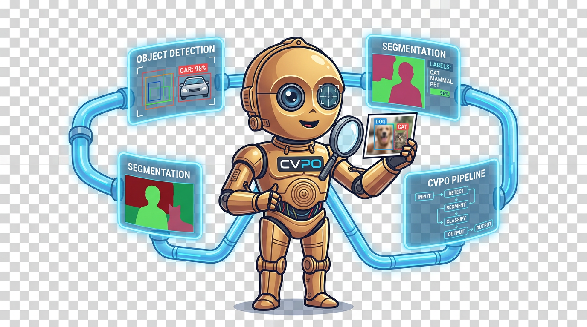

# CVPO



Computer Vision Pipeline Orchestrator (CVPO) is an open-source framework for building
deterministic computer vision pipelines from composable stages:
detection, segmentation, classification, and tracking.

## Project Goals

- Lower the barrier to entry for computer vision.
- Keep the core workflow deterministic and procedural (no LLM required to run).
- Support beginner, intermediate, and advanced learning paths.
- Provide hardware-aware guidance and clear tradeoff explanations.
- Privacy-first: hardware scanning stays local and is never transmitted.

## Current Status

Day 1 foundation + Day 2/3/4/5 deterministic workflow baselines are scaffolded:

- Python package structure (`src/cvpo/`)
- Core abstractions:
  - `Stage` interface
  - `Connector` interface
  - `Pipeline` linear executor
  - Typed data contracts in `cvpo.core.data_types`
- Frontend stubs:
  - CLI
  - Gradio app placeholder
  - Notebook helper placeholder
- Deterministic onboarding question system with frontend selection:
  - asks users which interface they want
  - explains what CLI, Gradio, and Notebook each provide
- Level 0 classification pipeline:
  - `SigLIPStage` interface with deterministic backend for zero-dependency local runs
  - optional real SigLIP backend via `transformers`
  - runnable CLI demo outputting structured JSON
- Level 1 detection -> segmentation pipeline:
  - `YOLOv8Stage` with deterministic backend and optional `ultralytics` backend
  - `SAM2Stage` deterministic rectangular-mask backend (SAM2 integration hook in place)
  - `DetectionToSegmentationConnector` as first deterministic connector
  - runnable CLI demo outputting segmentation summary JSON
- Level 2 detection -> segmentation -> classification:
  - `SegmentationToClassificationConnector`
  - region-level classification input support in `SigLIPStage`
- Level 3 full workflow demo:
  - deterministic tracking stage (`ByteTrackStage`) over synthetic frame sequence
  - end-to-end `detect -> segment -> classify -> track` demonstration in CLI
- Initial tests and process logs

## Planned Demo Progression

1. Level 0: Single-image classification (true hello world)
2. Level 1: Detection + segmentation
3. Level 2: Detection + segmentation + classification
4. Level 3: Detection + segmentation + classification + tracking

## Development

Requires Python 3.10+.

Install in editable mode:

```bash
pip install -e .[dev]
```

Install optional model and media I/O dependencies:

```bash
pip install -e .[models]
```

Install optional UI dependency:

```bash
pip install -e .[ui]
```

Run tests:

```bash
pytest
```

CLI (after editable install):

```bash
cvpo --version
```

Module entry:

```bash
python -m cvpo --version
```

No-install local runner (always works inside this repo):

```bash
python run_cvpo.py --version
```

Run Level 0 deterministic demo:

```bash
python run_cvpo.py --level0-demo --labels "goose,duck,pigeon,crow"
```

Run Level 0 with your own image:

```bash
python run_cvpo.py --level0-demo --labels "goose,duck,pigeon,crow" --input-image "/path/to/image.jpg"
```

Run Level 1 deterministic demo:

```bash
python run_cvpo.py --level1-demo
```

Run Level 2 deterministic demo:

```bash
python run_cvpo.py --level2-demo --labels "goose,duck,pigeon,crow"
```

Run Level 3 full deterministic workflow demo:

```bash
python run_cvpo.py --level3-demo
```

Run Level 3 with your own video:

```bash
python run_cvpo.py --level3-demo --input-video "/path/to/video.mp4" --max-frames 60
```

Run guided end-to-end workflow (frontend choice + honest assessment + execution):

```bash
python run_cvpo.py --workflow-demo --goal geese_tracking --frontend-choice gradio --skip-socratic
```

Run guided workflow with human-readable terminal output:

```bash
python run_cvpo.py --workflow-demo --goal geese_tracking --frontend-choice cli --format pretty
```

Launch Gradio guided UI:

```bash
python run_cvpo.py --launch-gradio
```

Run benchmark suite (JSON output):

```bash
python run_cvpo.py --benchmark --benchmark-workflow guided_geese --benchmark-repeats 10 --benchmark-warmup 2
```

Run benchmark with regression check against baseline:

```bash
python run_cvpo.py --benchmark --benchmark-workflow guided_geese --benchmark-baseline docs/process/reports/baseline.json --benchmark-regression-threshold 15.0
```

Save benchmark report and timeseries CSV:

```bash
python run_cvpo.py --benchmark --benchmark-workflow level3 --save-report docs/process/reports/level3_benchmark.json
```

Guided workflow now includes:
- privacy notice (data stays local, never transmitted)
- hardware capability card (system, CPU, cores, RAM, GPU flag)
- model requirement table with per-model fit status (good/degraded/not_recommended)
- pre-run validation with actionable suggestions and blocker/warning status
- deterministic decision-path card (goal -> CV task decomposition -> pipeline level)
- deterministic tradeoff cards by stage/model
- tiered Socratic question bank (beginner/intermediate/advanced)
- settings explainability (WHY each toggle exists)

Manual hardware override (if auto-detection is wrong):

```bash
python3 run_cvpo.py --workflow-demo --goal geese_tracking --override-ram-gb 32 --override-gpu-vram-gb 8 --format pretty
```

Override instructions and how-to-find-your-specs guidance appear automatically
in the guided output whenever a hardware issue is detected.

Save a run report for class presentation artifacts:

```bash
python run_cvpo.py --workflow-demo --goal geese_tracking --frontend-choice cli --format pretty --save-report docs/process/reports/geese_run.md
python run_cvpo.py --level3-demo --save-report docs/process/reports/level3_run.json
```

Run hygiene check before sharing repo publicly:

```bash
python tools/hygiene_check.py
```
