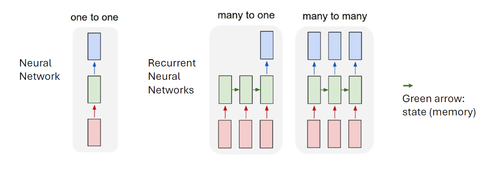

# CS4330 Computer Vision -- Midterm One-Stop Study Guide

> **Exam format:** Multiple choice + short answer | **45 minutes, 45 points** | Notes allowed (static content) | NO transformers or attention
   
---

## Exam Strategy (45 min / 45 points)

- **Pace:** ~1 point per minute. Do not spend more than 2 minutes on any single MC question.
- **Triage:** Scan the entire exam first. Answer every question you are confident about, then return to harder ones.
- **MC approach:** Eliminate two obviously wrong answers first. If stuck, look for the answer that uses precise course vocabulary (e.g., "translation equivariance" not just "invariance").
- **Short answer approach:** Write the key term first, then explain briefly. Graders look for correct terminology + correct reasoning. 2--3 sentences is usually sufficient.
- **Use your notes:** Tab/flag the invariance table, parameter counting formulas, kernel definitions, and the PCA summary. These are the highest-lookup-frequency items.
- **Common point losses:** forgetting clamping in pixel ops, confusing equivariance/invariance, BGR vs RGB, forgetting bias in parameter counts, saying PCA is supervised.
- **If unsure on MC:** the answer that includes a caveat or precise qualifier (e.g., "approximately invariant") is often correct over the absolute statement.

---

## 1. First Principles & Pixel Operations

---

### 1.1 What Is Computer Vision?

**Cheat-Sheet Bullets**
- CV = making computers interpret the content of images and video; also called image understanding, machine vision, computational vision
- CV is a subfield of AI; started ~1966 (Minsky's "summer vision project")
- Vision is an **inverse problem**: the 3D world is projected onto a 2D image, so information is irreversibly lost before any algorithm runs
- Context matters: identical pixel values can be perceived differently depending on surroundings (Adelson checker-shadow illusion)
- Three conceptual levels of processing:
  - **Low-level (image processing):** filtering, edges, curves, convolution
  - **Mid-level (image space ops):** grouping pixels, segmentation, 2D tracking
  - **High-level (scene understanding):** 3D geometry, classification, activity recognition
- Classic CV pipeline: **image space -> feature extraction -> feature space -> modeling/classification -> results**
- Features were historically hand-crafted (SIFT, 2004); now mostly learned via deep neural networks
- CV catalyzed the deep learning revolution: local redundancies + convolution enabled training efficiency, GPU hardware matched CNN computation patterns
- ImageNet (2012): AlexNet was first DNN entry, only team below 25% error; by 2017, 29/38 teams < 5% error

**Likely Exam Questions**

> **MC:** Why is computer vision considered an "inverse problem"?
> (a) Because it converts text to images
> (b) Because it tries to recover 3D scene information from a 2D projection where information has been lost *
> (c) Because it inverts pixel values
> (d) Because it runs algorithms in reverse order

> **Short Answer:** Name and briefly describe the three conceptual levels of CV processing.

**Answer Expectations**
- Low-level: operates on raw pixels (filtering, edge detection, convolution)
- Mid-level: groups/segments pixels, tracks objects in 2D image space
- High-level: interprets objects, 3D geometry, classifies scenes, recognizes activities
- Credit for noting boundaries are blurry in practice with cross-level processing

> **MC:** What key event in 2012 marked the beginning of deep learning dominance in CV?
> (a) SIFT was published
> (b) AlexNet won ImageNet with the first CNN entry, achieving error rates far below all other teams *
> (c) Transformers were introduced
> (d) GPUs were invented

**Common Traps / Misconceptions**
- "CV is just image processing" -- image processing is only the low level; CV includes understanding/interpretation
- Confusing CV (extracting meaning from images) with computer graphics (generating images from models) -- they are inverses
- Thinking hand-crafted features are obsolete -- SIFT and similar are still used in constrained/embedded settings
- Assuming vision is "easy" because humans do it effortlessly -- ~50% of the human brain is devoted to visual processing

---

### 1.2 What Is a Pixel? (Sampling, Discretization, Noise)

**Cheat-Sheet Bullets**
- A **pixel** (picture element) is a single sampled measurement of light intensity at one spatial location
- Images are formed by **sampling** (discretizing) a continuous light field into a grid of discrete values
- Pixel values are typically stored as `uint8` (unsigned 8-bit integer): range **[0, 255]** where 0 = black, 255 = white (for grayscale)
- Sensor noise is inherent: even identical scenes produce slightly different pixel values across captures

**Likely Exam Questions**

> **Short Answer:** What does `uint8` mean in the context of image pixel values, and what is its range?

**Answer Expectations**
- Unsigned 8-bit integer
- Range: 0 to 255 (2^8 - 1)
- 0 = black, 255 = white for grayscale
- Values outside this range must be clamped or will wrap around

> **MC:** Sampling in the context of digital images refers to:
> (a) Reducing the number of colors
> (b) Discretizing a continuous light field into a finite grid of pixel values *
> (c) Compressing the image file
> (d) Converting from RGB to grayscale

**Common Traps / Misconceptions**
- Confusing quantization (discretizing intensity values) with spatial sampling (discretizing spatial positions) -- both happen during image formation
- Forgetting that `uint8` arithmetic wraps around: 250 + 10 = 4 in numpy (not 260), unless you cast to int first

### Aliasing

**Definition**
- Aliasing occurs when a signal is sampled too coarsely to represent its high-frequency content

**Image Example**
- You cannot shrink an image by simply taking every other pixel
- If you do, characteristic errors appear (jagged edges, moiré patterns)

**Why This Happens**
- High-frequency detail violates the Nyquist sampling condition
- Frequencies above half the sampling rate fold back into lower frequencies

**Correct Approach**
- Apply a **low-pass filter (e.g., Gaussian blur)** before downsampling

**Exam Trap**
- Resizing ≠ subsampling
- Proper resizing always includes pre-smoothing
-if you use a larger kernel on a gaussian filter, 
---

### 1.3 Image as an Array (H x W x C)

**Cheat-Sheet Bullets**
- In OpenCV/numpy, an image is a `numpy.ndarray`
- Shape convention: `img.shape` = **(H, W, C)** = (height/rows, width/columns, channels)
  - `img.shape[0]` = **height** (number of rows)
  - `img.shape[1]` = **width** (number of columns)
  - `img.shape[2]` = **channels** (3 for color, absent for grayscale)
- Grayscale image shape: **(H, W)** -- only 2 dimensions
- Color image shape: **(H, W, 3)**
- **OpenCV uses BGR order** (not RGB); matplotlib uses RGB
  - Conversion: `cv2.cvtColor(img, cv2.COLOR_BGR2RGB)`
- Channel access: `img[:, :, 0]` = first channel (Blue in OpenCV)
- Pixel access: `img[row, col]` or `img[y, x]` -- **row-first** indexing
- Cropping: `img[y1:y2, x1:x2]` (numpy slicing)
- Resizing: `cv2.resize(img, None, fx=scale_x, fy=scale_y)` where `fx` = width scale, `fy` = height scale

**Likely Exam Questions**

> **MC:** For a color image loaded with OpenCV, `img.shape` returns `(480, 640, 3)`. What does `480` represent?
> (a) Width in pixels
> (b) Number of color channels
> (c) Height in pixels (number of rows) *
> (d) Bit depth

> **Short Answer:** An image loaded with `cv2.imread()` has shape `(100, 200, 3)`. How would you extract just the green channel? What would its shape be?

**Answer Expectations**
- `green = img[:, :, 1]` (OpenCV is BGR, so index 1 = green)
- Shape: `(100, 200)` -- a 2D array
- Full credit requires knowing BGR ordering

> **MC:** OpenCV loads color images in what channel order by default?
> (a) RGB (b) BGR * (c) GRB (d) HSV

**Common Traps / Misconceptions**
- **BGR vs RGB is the #1 lab pitfall**: displaying an OpenCV image in matplotlib without conversion produces wrong colors (red and blue are swapped)
- Confusing `img[row, col]` (y, x) with `img[x, y]` -- numpy uses row-major (height-first) indexing
- Forgetting that a grayscale image has shape `(H, W)` not `(H, W, 1)` in OpenCV
- `fx` in `cv2.resize` controls **width** (x-axis), `fy` controls **height** (y-axis) -- easy to reverse

---

### 1.4 Pixel-Wise Operations (Brightness, Contrast, Thresholding)

**Cheat-Sheet Bullets**
- **Point operations** (pixel-wise): output depends only on the single input pixel, not its neighbors
- General linear point operation: **y = ax + b**
  - **a (alpha)** = contrast (scales/stretches the histogram)
  - **b (beta)** = brightness (shifts the histogram left/right)
  - OpenCV: `cv2.convertScaleAbs(img, alpha=a, beta=b)`
- **Inversion:** `out = 255 - pixel` (or `cv2.bitwise_not(img)`)
- **Clamping** is required: values outside [0, 255] must be clipped (0 if negative, 255 if > 255)
  - Without clamping, numpy `uint8` silently wraps: `250 + 10` = `4`
- **Thresholding** (`cv2.threshold`):
  - `THRESH_BINARY`: pixel > T -> maxVal, else 0
  - `THRESH_BINARY_INV`: pixel > T -> 0, else maxVal
  - `THRESH_TRUNC`: pixel > T -> T, else unchanged
  - `THRESH_TOZERO`: pixel > T -> unchanged, else 0
  - `THRESH_TOZERO_INV`: pixel > T -> 0, else unchanged
- **Masking**: boolean array (`dark_mask = gray <= thresh`) used to selectively apply operations to subsets of pixels

### Lab-Style Example: uint8 Overflow (Common Exam Trap)

In the lab, applying arithmetic directly to a uint8 image caused unexpected results:

Example:
- pixel value = 250 (uint8)
- operation: x + 10
- result: **4**, not 260

Why?
- uint8 arithmetic wraps modulo 256
- 250 + 10 = 260 ≡ 4 (mod 256)

**Correct workflow**
1. Cast to int or float
2. Apply operation
3. Clamp to [0,255]
4. Cast back to uint8

**Exam phrasing to expect:**
> “Why does this operation produce incorrect results when applied directly to a uint8 image?”


**Likely Exam Questions**

> **Short Answer:** Given a grayscale image, write the pixel-wise operation that doubles the contrast and reduces brightness by 50. What happens if a pixel with value 200 undergoes this operation?

**Answer Expectations**
- Operation: `y = 2x - 50`
- For pixel = 200: `y = 2(200) - 50 = 350`
- Must be clamped to 255 (max of uint8)
- Credit for mentioning clamping/saturation

> **MC:** Which thresholding mode preserves original pixel values above the threshold and sets everything else to 0?
> (a) THRESH_BINARY
> (b) THRESH_TRUNC
> (c) THRESH_TOZERO *
> (d) THRESH_BINARY_INV

> **Short Answer:** You apply `y = 3x + 70` to enhance dark regions of an image. A pixel originally has value 5. What is the output value?

**Answer Expectations**
- `y = 3(5) + 70 = 85`
- No clamping needed (85 is within [0, 255])

**Common Traps / Misconceptions**
- Forgetting to **clamp** values: the most common bug in pixel operations
- Confusing `THRESH_TOZERO` (keeps values above T) with `THRESH_BINARY` (forces values to 0 or maxVal -- loses all intensity variation)
- Thinking brightness shift (`+b`) changes contrast -- it only shifts; contrast requires multiplicative scaling (`*a`)
- Computing in `uint8` directly causes overflow; cast to `int` or `float` first, then clamp and cast back


### 1.4b Thresholding (Piecewise definitions)  ✅ CLARITY

Let x be a pixel, threshold T, maxVal M.

- **BINARY:**        y = M if x > T else 0
- **BINARY_INV:**    y = 0 if x > T else M
- **TRUNC:**         y = T if x > T else x
- **TOZERO:**        y = x if x > T else 0
- **TOZERO_INV:**    y = 0 if x > T else x

**Key intuition**
- BINARY destroys intensity detail (only 0 or M).
- TOZERO keeps original values above T (preserves intensity there).

---


### 1.5 Linear vs. Nonlinear Operations

**Cheat-Sheet Bullets**
- **Linear operation:** `f(ax + by) = a*f(x) + b*f(y)` (satisfies superposition and scaling)
  - Examples: brightness adjustment (`+b`), contrast scaling (`*a`), inversion (`255 - x` is affine/linear)
- **Nonlinear operation:** does NOT satisfy superposition
  - Examples: **thresholding**, clamping/clipping, gamma correction, absolute value
      - Clipping = saturation at min/max values (e.g., 0 or 255).
- Once saturation occurs, output no longer scales proportionally with input.
  Loss of Additivity
      Clipping makes
      f(x+y)\neq f(x)+f(y) because x+y may clip while f(x) and f(y) do not.
      Loss of Homogeneity
      Clipping makes f(\alpha x)\neq \alpha f(x) whenever \alpha x exceeds the valid range.

Core Idea
- Saturation is nonlinear, so any operation that clips pixel values cannot remain strictly linear.

- Thresholding is the classic exam example of a nonlinear pixel-wise operation
- Key test: **can you express the output as `y = ax + b` for all inputs?** If yes, it is linear (affine). If there are conditionals (if/else, min, max), it is nonlinear.

**Likely Exam Questions**

> **MC:** Which of the following is a nonlinear pixel-wise operation?
> (a) Multiplying all pixel values by 2
> (b) Adding 50 to all pixel values
> (c) Applying a threshold to convert to binary *
> (d) Inverting pixel values (255 - x)

> **Short Answer:** Is `y = 2x - 50` (with clamping to [0, 255]) a linear operation? Explain.

**Answer Expectations**
- Without clamping: yes, it is affine/linear
- With clamping: **no**, because clamping introduces a piecewise nonlinearity (min/max)
- Full credit requires distinguishing the two cases

**Common Traps / Misconceptions**
- Saying `y = ax + b` is "linear" without qualification -- strictly, it is **affine**; in many CV contexts this distinction is ignored, but be aware if asked
- Forgetting that clamping makes an otherwise linear operation **nonlinear**

---

### 1.6 What Pixel-Wise Ops Preserve and Destroy

**Cheat-Sheet Bullets**
- **Preserved:** spatial structure (every pixel stays at its original position), image dimensions, relative pixel positions
- **Destroyed / not accessible:** spatial relationships between neighbors, intensity detail after clamping, all gradient information after binary thresholding
- **Key insight:** pixel-wise operations cannot extract structural or geometric information because each pixel is processed independently

**Likely Exam Questions**

> **Short Answer:** A student applies binary thresholding to an image. What information is preserved and what is lost?

**Answer Expectations**
- Preserved: spatial positions of pixels, image dimensions, rough shape outlines
- Lost: all intensity gradient information, subtle details, texture within regions

> **MC:** Pixel-wise operations cannot:
> (a) Change the brightness of an image
> (b) Detect edges in an image *
> (c) Invert an image
> (d) Apply a threshold

> **Short Answer:** Why are pixel-wise operations insufficient for edge detection?

**Answer Expectations**
- Edge detection requires comparing a pixel to its **neighbors** to find intensity gradients
- Pixel-wise operations process each pixel independently with no access to surrounding values

**Common Traps / Misconceptions**
- Thinking thresholding "detects" objects -- it only separates intensity ranges; it has no concept of boundaries or meaning
- Confusing "preserves spatial structure" with "uses spatial information"


### 1.7 Properties of Operations (Linearity, Equivariance, etc.)  ✅ HIGH-YIELD

**WRITE THIS DOWN (definitions):**
- **Linearity:** f(a x + b y) = a f(x) + b f(y)
- **Affine:** f(x) = A x + b (linear + translation); often casually called “linear” in CV
- **Translation equivariance:** shift input → output shifts the same way (convolution has this)
- **Translation invariance:** shift input → output unchanged (often approximated via pooling / global pooling)
- **Commutative:** f * g = g * f  (true for convolution; NOT generally true for correlation)
- **Associative:** (f * g) * h = f * (g * h)  (true for convolution)
- **Distributive:** f * (g + h) = f * g + f * h  (true for convolution)
- **Identity:** identity filter leaves signal unchanged (delta kernel)
- **Invertibility:** many operations are not invertible (thresholding, clamping, downsampling)

**Common exam traps**
- **Convolution is equivariant, not invariant.**
- **Clamping/thresholding destroys information → not invertible.**
- “Linear” vs “affine”: if the prof is picky, say affine for ax+b.

---

## 2. Spatial Filtering & Convolution

---

### 2.1 Neighborhood Operations vs. Pixel-Wise Operations

**Cheat-Sheet Bullets**
- **Pixel-wise:** output depends only on the single input pixel at (r, c). No neighbor information.
- **Neighborhood (spatial):** output at (r, c) depends on a **local region** defined by a kernel/window.
- Neighborhood ops can detect edges, gradients, textures, corners, blobs.
- Kernel is typically small and odd-sized (3x3, 5x5, 7x7) with a well-defined center pixel.
- Spatial filtering slides the kernel across every position and computes a weighted sum.

**Likely Exam Questions**

> **MC:** What distinguishes a neighborhood operation from a pixel-wise operation?
> (a) Neighborhood operations change the image dimensions
> (b) Neighborhood operations use surrounding pixel values to compute the output at each position *
> (c) Pixel-wise operations are always nonlinear
> (d) Neighborhood operations can only be applied to grayscale images

> **Short Answer:** Why can't a pixel-wise operation detect an edge?

**Answer Expectations**
- An edge is defined by intensity change between adjacent pixels
- Point operations process each pixel independently with no access to neighbors
- Cannot measure differences/gradients across spatial locations

**Common Traps / Misconceptions**
- Thinking larger kernels are always better -- larger kernels blur more and are more expensive
- Confusing spatial filtering with frequency domain filtering


### 2.X Output Dimensions for Convolution / Pooling  ✅ MUST-HAVE

Let input be H×W, kernel K×K, stride S, padding P:

**Output height:** (H - K + 2P)/S + 1  
**Output width:**  (W - K + 2P)/S + 1  

**Special cases**
- **"valid" conv:** P=0 → output shrinks
- **"same" conv (stride 1):** choose P = floor(K/2) → output keeps size

**Quick example**
Input 32×32, K=5, S=1, P=0 → output = (32-5)/1+1 = 28 → 28×28  
MaxPool 2×2, S=2 on 16×16 → 8×8

### 2.Y Convolution Parameter Count & Compute Cost  ✅ PROF-WARNED

**Shapes**
- Input: H×W×C_in
- Kernel weights: K×K×C_in×C_out
- Output: H_out×W_out×C_out

**#Parameters (with bias):**
K*K*C_in*C_out + C_out

**Compute cost (multiply-adds, rough):**
H_out * W_out * C_out * (K*K*C_in)

**Separable Gaussian speedup**
- 2D K×K Gaussian: O(K^2) per pixel
- Two 1D passes: O(2K) per pixel  → much faster for large K

---

### 2.2 Correlation vs. Convolution

**Cheat-Sheet Bullets**
- **Cross-correlation:** kernel applied **as-is** (no flipping). `G(r,c) = sum H(i,j) * F(r+i, c+j)`
- **Convolution:** kernel **flipped 180 degrees** before applying. `G(r,c) = sum H(i,j) * F(r-i, c-j)`
- For **symmetric kernels** (e.g., Gaussian), correlation = convolution (flipping a symmetric kernel yields the same kernel)
- Convolution is **commutative** and **associative**; correlation is not
  - Associativity: `(f * g) * h = f * (g * h)` -- can pre-combine kernels
- In deep learning, "convolution layers" typically implement **cross-correlation** (kernel weights are learned, flip is absorbed)

**Likely Exam Questions**

> **MC:** Convolution differs from correlation in that convolution:
> (a) Uses a larger kernel
> (b) Flips the kernel 180 degrees before applying *
> (c) Operates in the frequency domain
> (d) Can only be applied to 1D signals

> **Short Answer:** Under what condition does correlation produce the same result as convolution? Why?

**Answer Expectations**
- When the kernel is **symmetric** (invariant to 180-degree rotation)
- Flipping a symmetric kernel produces the same kernel

> **MC:** Which mathematical property does convolution have that correlation does not?
> (a) Linearity
> (b) Associativity *
> (c) The ability to detect edges
> (d) Computational efficiency

**Common Traps / Misconceptions**
- Saying "convolution flips left-right" -- it flips **both** horizontally and vertically (180-degree rotation)
- Assuming correlation and convolution always give different results
- Thinking the flip matters in CNNs -- it doesn't, because weights are learned

---

### 2.3 Kernels as Local Pattern Detectors

**Cheat-Sheet Bullets**
- A kernel encodes a **pattern**; convolution measures how well each local patch matches it
- **Identity kernel:** all zeros except center = 1. Output = input.
- **Box/mean filter:** all entries equal (e.g., 1/9 for 3x3). Averages neighborhood. Produces **blurring**.
- **Edge-detecting kernels:** positive and negative weights to measure intensity differences
- **Sharpening kernel:** identity + scaled edge enhancement (e.g., center = 5, neighbors = -1)
- Kernels summing to **1** preserve brightness; kernels summing to **0** extract differences (edges)

### Lab-Style Example: What a Kernel "Detects"

Given kernel:
-1  0  1
-1  0  1
-1  0  1

Interpretation:
- Computes difference between left and right neighbors
- Strong response when intensity changes horizontally
- **Detects vertical edges**

**Exam shortcut**
- Kernel varies left↔right → detects vertical edges
- Kernel varies top↔bottom → detects horizontal edges

### Box Filter (Mean Filter)

**Definition**
- Replaces each pixel with the **average of its neighborhood**
- Achieves a **smoothing effect** by removing sharp, high-contrast features
- Acts as a **low-pass filter** (suppresses high-frequency detail)

**Example (3×3 box filter):**
1/9 1/9 1/9
1/9 1/9 1/9
1/9 1/9 1/9

**Key Properties**
- Kernel entries are all equal
- Kernel sums to **1** → preserves average brightness
- Reduces noise but **blurs edges**

**Important Insight**
- Box filters are separable:
  - A 2D box filter can be written as the convolution of a vertical and horizontal 1D filter
- This reduces computation cost

**Exam Trap**
- Box filter ≠ Gaussian
- Box filter weights all pixels equally → more artifacts than Gaussian smoothing

### Convolution: Step-by-Step Intuition

At each pixel:
1. Center the kernel over the pixel
2. Multiply each kernel value with the corresponding image pixel
3. Sum all products
4. Assign the result to the output pixel

This process is repeated for **every pixel location**.
**Likely Exam Questions**

> **Short Answer:** A 3x3 kernel has all entries equal to 1/9. What does it do?

**Answer Expectations**
- Computes the **average** of the 3x3 neighborhood (box/mean filter)
- Effect: **blurs** the image
- Reduces noise but also reduces sharpness

> **MC:** A kernel with weights that sum to 0 will typically produce:
> (a) A brighter image
> (b) An image with values centered around zero, highlighting edges/differences *
> (c) An identical copy of the image
> (d) A fully black image

**Common Traps / Misconceptions**
- Confusing **blurring** (smoothing, low-pass) with **sharpening** (high-pass)
- Forgetting that sum-to-0 kernels produce positive and negative values that may need rescaling for display

### Unsharp Masking (Image Sharpening)

**Goal**
- Enhance edges and fine details

**Formula**
f_sharpened(x, y) = f(x, y) − f_smoothed(x, y)

**Process**
1. Smooth the image (usually with Gaussian or box filter)
2. Subtract the smoothed image from the original
3. Emphasizes high-frequency components (edges)

**Key Insight**
- This is a form of **high-pass filtering**
- Often implemented as:
  f + α(f − f_smoothed)

**Exam Trap**
- Sharpening does NOT detect edges — it amplifies them

---

### 2.4 Gradients and Edge Detection

**Cheat-Sheet Bullets**
- An **edge** = sharp change in intensity, detected by measuring the **gradient**
- Image gradient: a vector with **magnitude** (`sqrt(Gx^2 + Gy^2)`) and **direction** (`arctan(Gy/Gx)`)
- `Gx` = horizontal gradient -> detects **vertical** edges
- `Gy` = vertical gradient -> detects **horizontal** edges
- Gradient direction is **perpendicular** to the edge orientation
- Edges are where gradient magnitude is large

### What Is an Edge?

- Edges are locations in an image that correspond to **object boundaries**
- An edge is a pixel where **image brightness changes abruptly**
- Edge value is computed from the **behavior of the image function in a local neighborhood**

**Important**
- An edge is a **local property**
- Requires neighborhood operations (cannot be detected pixel-wise)

**Mathematically**
- Edges correspond to large values of the **first derivative** (gradient)
- Or zero-crossings of the **second derivative**


### Concrete Gradient Example (1D → 2D intuition)

Pixel intensities:
[2, 2, 2, 0, 0, 0]

- Large change between indices 2 and 3
- First derivative is large at that location
- Indicates an edge

Inaising to 2D:
- Gx measures changes left↔right
- Gy measures changes up↕down
- Edge orientation is perpendicular to gradient direction


**Likely Exam Questions**

> **MC:** A horizontal gradient kernel (computing Gx) primarily detects:
> (a) Horizontal edges
> (b) Vertical edges *
> (c) Diagonal edges
> (d) All edges equally

> **Short Answer:** Given pixel values `[10, 10, 10, 100, 100, 100]`, where is the edge and what is the gradient?

**Answer Expectations**
- Edge at transition between 10 and 100 (index 2-3)
- Gradient (finite difference): 100 - 10 = 90

**Common Traps / Misconceptions**
- **Most common trap:** `Gx` (horizontal derivative) detects **vertical** edges, and vice versa
- Forgetting gradient is a **vector** (magnitude + direction), not just a scalar

---

### 2.5 Sobel, Prewitt, Laplacian, Gaussian Filters

**Cheat-Sheet Bullets**

**Prewitt (3x3):**
```
Gx:               Gy:
-1  0  1          -1 -1 -1
-1  0  1           0  0  0
-1  0  1           1  1  1
```
- Simple gradient approximation. Equal weighting of all rows/columns.

**Sobel (3x3):**
```
Gx:               Gy:
-1  0  1          -1 -2 -1
-2  0  2           0  0  0
-1  0  1           1  2  1
```
When you apply a Sobel filter at location (x,y):
- You take the 3×3 block of pixels centered at (x,y)
- You multiply that block element‑wise with the Sobel kernel
- You sum the products
- You store that single number as the output value at (x,y)
a  b  c
d [e] f   ← e is the pixel whose gradient we’re computing
g  h  i

Convolution =
pairwise multiply + sum
applied to the current 3×3 window.
Sliding =
moving that window across the image so you can
repeat the convolution at every pixel.


- Extra weight on center row/column -> built-in **Gaussian smoothing** perpendicular to gradient direction
- Sobel = gradient estimation + smoothing. Most commonly used gradient operator. approximates first-order spatial derivatives. gradients are large at edges

**Laplacian (3x3, one common form):**
```
 0  1  0
 1 -4  1
 0  1  0
```                                                                          - 
- **Second-order** derivative. Detects edges as **zero-crossings**. ----------------
- Isotropic (responds equally to edges in all directions). Very sensitive to noise.
- Sums to 0.

**Gaussian filter (3x3, approximate):**
```
1/16  2/16  1/16
2/16  4/16  2/16
1/16  2/16  1/16
```
- **Smoothing/blurring**. Low-pass filter. Characterized by **sigma**: larger sigma = more blur. use this before laplacian filter to stabilize second-order derivative
- **Separable:** 2D Gaussian = two 1D passes (row then column). Faster computation.
- Sums to 1 (preserves brightness). Symmetric: correlation = convolution.

**Likely Exam Questions**

> **MC:** How does Sobel differ from Prewitt?
> (a) Sobel uses a 5x5 kernel
> (b) Sobel applies extra weight to the center row/column, providing built-in smoothing *
> (c) Sobel only detects horizontal edges
> (d) Prewitt is a second-order derivative

> **Short Answer:** Why is the Laplacian more sensitive to noise than Sobel?

**Answer Expectations**
- Laplacian computes **second derivative**; differentiation amplifies high-frequency components including noise
- Two rounds of differentiation amplify noise more than one
- In practice, Laplacian is often combined with Gaussian pre-smoothing (LoG)

> **MC:** Increasing sigma in a Gaussian filter:
> (a) Sharpens the image
> (b) Produces more blurring and requires a larger kernel *
> (c) Detects finer edges
> (d) Increases image contrast

> **Short Answer:** Why is the Gaussian filter called "separable"?

**Answer Expectations**
- 2D Gaussian decomposes into two 1D Gaussians (horizontal pass then vertical pass)
- Reduces computation from N^2 to 2N multiplications per pixel

**Common Traps / Misconceptions**
- Confusing Sobel (first derivative, directional) with Laplacian (second derivative, isotropic)
- Confusing Gaussian (smoothing, all positive, sums to 1) with Laplacian (edge detection, has negatives, sums to 0)
- Saying "Sobel detects all edges equally" -- Sobel is directional; you need both Gx and Gy

---

### 2.6 Gaussian vs. Laplacian Pyramids (Intuition)

**Cheat-Sheet Bullets**

| Property | Gaussian Pyramid | Laplacian Pyramid |
|---|---|---|
| Each level | Blurred + downsampled image | Difference between consecutive Gaussian levels |
| Filter type | Low-pass | Band-pass |
| Contains | Progressively coarser versions | Detail/edges at each scale |
| Reconstruction | Cannot perfectly reconstruct original | **Can** reconstruct original (all levels + coarsest Gaussian) |

- Gaussian pyramid: Level 0 = original, each subsequent level = blur + downsample by 2x
- Laplacian pyramid: Level N = Gaussian(N) - Upsample(Gaussian(N+1))
- Laplacian pyramid used in image blending (Burt & Adelson), compression, multi-scale editing

**Likely Exam Questions**

> **Short Answer:** Explain the difference between a Gaussian and Laplacian pyramid.

**Answer Expectations**
- Gaussian: each level is progressively blurred and downsampled (low-pass at increasing scale)
- Laplacian: each level stores the difference/detail between two consecutive Gaussian levels (band-pass)
- Laplacian + coarsest Gaussian allows perfect reconstruction

> **MC:** A Laplacian pyramid level contains:
> (a) A downsampled version of the original - Downsampling an image reduces its resolution by decreasing the number of pixels, making the file smaller and faster to load
> (b) The difference between two consecutive Gaussian pyramid levels *
> (c) The result of applying a Laplacian edge detector
> (d) A sharpened version of the image

**Common Traps / Misconceptions**
- Confusing **Laplacian pyramid** (multi-scale representation) with the **Laplacian operator** (second derivative kernel)
- Thinking the Gaussian pyramid preserves all information -- each downsampling step permanently loses high-frequency detail
- Forgetting reconstruction requires **all** Laplacian levels **plus** the smallest Gaussian level

---

## 3. Features, Feature Space, and PCA

---

### 3.1 What Is a Feature / Landmark?

**Cheat-Sheet Bullets**
- A **feature** is a measurable property of an image region that carries useful information for a task
- A **landmark** (keypoint/interest point) is a specific spatial location reliably detectable across views
- Good landmarks: **repeatable**, **distinctive**, **localizable**
- Classic pipeline: detect landmarks -> describe local appearance -> match/classify

**Likely Exam Questions**

> **MC:** A good image feature should be:
> (a) Present in every pixel
> (b) Repeatable, distinctive, and precisely localizable *
> (c) As large as possible
> (d) Computed from a single pixel value

> **Short Answer:** Difference between a "feature" and a "landmark"?

**Answer Expectations**
- Landmark/keypoint = specific spatial location ("where?")
- Feature/descriptor = measured property at that location ("what does it look like?")

**Common Traps / Misconceptions**
- Using "feature" and "keypoint" interchangeably -- keypoint is a location; descriptor is the representation
- Thinking every pixel is a good feature

### What Makes a Good Feature?

A good feature should be:
- **Repeatable** (detected under different views)
- **Distinctive** (unlikely to be confused)
- **Localizable** (precise position)

**Why Corners Are Good**
- Corners have intensity changes in **two directions**
- Sliding a filter over a corner causes large response changes
- Unique localization in both x and y

**Why Edges Are Weaker**
- Change in only one direction
- Ambiguous along the edge (aperture problem)

---

### 3.2 Why Edges Are Weak Features; Why Corners Are Stronger

**Cheat-Sheet Bullets**
- **Edge:** strong gradient in one direction, ambiguous along the edge (**aperture problem**)
- **Corner:** strong gradients in **two independent directions** -> uniquely localizable in 2D
- **Flat region:** no gradient -> uninformative
- **Harris corner detector** uses structure tensor eigenvalues:
  - Two small eigenvalues -> flat
  - One large, one small -> edge
  - Two large eigenvalues -> corner
- Harris response: `R = det(M) - k * trace(M)^2`

**Likely Exam Questions**

> **Short Answer:** Using eigenvalue interpretation, explain why a corner is better than an edge as a feature.

**Answer Expectations**
- Two large eigenvalues = intensity change in two independent directions = uniquely localizable
- One large, one small = edge = ambiguous along edge direction (aperture problem)

> **MC:** In the Harris detector, two large eigenvalues indicate:
> (a) Flat region (b) Edge (c) Corner * (d) Noise

**Common Traps / Misconceptions**
- Edges are useful for segmentation; they're specifically weak for **point matching** due to aperture problem
- Confusing the structure tensor (2x2 matrix of gradient statistics) with the image gradient itself

---

### 3.3 Feature Detection vs. Feature Description

**Cheat-Sheet Bullets**
- **Detection:** finding *where* interesting points are (Harris, FAST, DoG)
- **Description:** computing *what* the local region looks like (SIFT descriptor, ORB, HOG)
- These are **separate, modular stages**
- SIFT does both: DoG for detection, gradient histogram for description
- Matching: compare descriptors via distance metric (Euclidean, Hamming)

**Likely Exam Questions**

> **Short Answer:** Distinguish detection from description. Give one example algorithm for each.

**Answer Expectations**
- Detection = locating keypoints: Harris, FAST
- Description = encoding local appearance: SIFT descriptor (128-dim)

> **MC:** SIFT performs:
> (a) Only detection (b) Only description (c) Both * (d) Neither

**Common Traps / Misconceptions**
- "SIFT detects corners" -- SIFT detects **blob-like** structures using DoG, not corners
- Conflating detection and description as inseparable

---

### 3.4 Invariances: Translation, Rotation, Scale, Illumination

**Cheat-Sheet Bullets**

| Transformation | How achieved | Example |
|---|---|---|
| Translation | Scan all positions | All detectors |
| Rotation | Canonical orientation | SIFT, ORB |
| Scale | Scale-space / pyramids | SIFT (DoG) |
| Illumination | Descriptor normalization (L2) | SIFT |

- **Invariance** = feature/descriptor produces the same output despite a transformation
- No feature is invariant to everything -- invariance vs. distinctiveness is a fundamental tradeoff

**Likely Exam Questions**

> **Short Answer:** How does SIFT achieve scale invariance?

**Answer Expectations**
- Builds scale-space with Gaussians at multiple sigma values
- Detects extrema in Difference of Gaussians across scales
- Each keypoint gets a characteristic scale; descriptor computed at that scale

> **MC:** Normalizing a descriptor to unit length provides invariance to:
> (a) Rotation (b) Translation (c) Multiplicative illumination changes * (d) Occlusion

**Common Traps / Misconceptions**
- Confusing **invariance** (output unchanged) with **equivariance** (output changes predictably)
- Illumination invariance typically handles only **global** brightness changes, not local shadows

### Types of Invariance

| Type | Meaning | Example |
|---|---|---|
| Illumination | Robust to brightness/contrast changes | Descriptor normalization |
| Scale | Same feature detected at different sizes | SIFT scale-space |
| Rotation | Same descriptor after rotation | SIFT orientation alignment |
| Affine | Robust to skew, shear | Approximate (ASIFT) |
| Full Perspective | Robust to viewpoint change | Very hard; learned features |

**Key Distinction**
- Invariance = output does not change
- Equivariance = output changes predictably (e.g., convolution)

**Exam Trap**
- CNNs are translation **equivariant**, not invariant

### SIFT — Scale Invariant Feature Transform - SIFT[4] can robustly identify objects even among clutter and under partial occlusion, because the SIFT feature descriptor is invariant to uniform scaling, orientation, illumination changes, and partially invariant to affine distortion.

D. Lowe, IJCV 2004

**Pipeline Overview**
1. **Scale selection**
   - Build scale-space using Gaussian blur
   - Detect extrema in Difference of Gaussians (DoG)
2. **Keypoint localization**
   - Refine location in space and scale
3. **Orientation assignment**
   - Dominant gradient direction
   - Achieves rotation invariance
4. **Descriptor construction**
   - 4×4 grid of cells
   - 8-bin gradient orientation histograms
   - Total: **128-dimensional descriptor**
5. **Normalization**
   - L2 normalize → illumination invariance

**Why SIFT Works**
- Invariant to scale, rotation, and illumination
- Highly distinctive
- Computationally expensive but robust

**Exam Trap**
- SIFT is NOT learned
- SIFT detects blobs, not corners

---

### 3.5 Image to Feature Vector (Dimensionality)

**Cheat-Sheet Bullets**
- Raw pixel vector: 28x28 grayscale -> 784 dimensions; 256x256 RGB -> 196,608 dimensions
- Natural images occupy a tiny subspace (**manifold**) of the full space
- Feature extraction reduces dimensionality while keeping discriminative information

**Likely Exam Questions**

> **MC:** Converting a 32x32 RGB image to a raw feature vector yields dimension:
> (a) 32 (b) 1024 (c) 3072 * (d) 32768

**Common Traps / Misconceptions**
- Forgetting to multiply by channels for color images
- Thinking high-dimensional = better representation

---

### 3.6 Feature Space, Manifolds, Sparsity

**Cheat-Sheet Bullets**
- Each image = a point in N-dimensional feature space
- Similar images should be **close**; dissimilar images **far apart**
- **Manifold hypothesis:** real images lie on a low-dimensional manifold within the high-dimensional space
- **Curse of dimensionality:** in very high dimensions, distances become uniform, nearest-neighbor methods degrade

**Likely Exam Questions**

> **Short Answer:** What is the manifold hypothesis?

**Answer Expectations**
- Natural images lie on a low-dimensional manifold within high-dimensional pixel space
- Effective degrees of freedom are much fewer than number of pixels
- Justifies dimensionality reduction

> **MC:** The curse of dimensionality refers to:
> (a) Images being too large to store
> (b) Distances becoming less meaningful as dimensions increase *
> (c) Kernels becoming too large
> (d) Features becoming more discriminative

**Common Traps / Misconceptions**
- Thinking more features always help -- beyond a point, added dimensions hurt (overfitting, distance concentration)
- Assuming the manifold is flat/linear -- real manifolds are typically nonlinear

---

### 3.7 PCA (Principal Component Analysis)

**Cheat-Sheet Bullets**

**Core Idea:**
- PCA finds directions of **maximum variance**, projects data onto them and its unsupervised!
- PC1 captures most variance, PC2 second most (orthogonal to PC1), etc.

**Eigenvectors / Eigenvalues:**
- Covariance matrix eigenvectors = principal component directions (new axes)
- Eigenvalues = variance captured along each direction
- Eigenvectors are orthogonal; sorted by eigenvalue magnitude

**Dimensionality Reduction:**
- Keep top k components (largest eigenvalues), discard the rest
- Choose k to retain desired fraction of total variance (e.g., 95%)
- Reconstruction error = sum of discarded eigenvalues

**Compression / Eigenfaces:**
- Store each image as k coefficients instead of N pixel values
- Eigenfaces: top eigenvectors of face dataset capture major modes of variation (often lighting, pose)

**What PCA Preserves vs. Destroys:**
- **Preserves:** linear structure, global variance, approximate distances
- **Destroys:** nonlinear structure, local neighborhoods, fine details in low-variance directions
- PCA is **unsupervised** -- does not use class labels, maximizes variance not class separability

### PCA in Lab Terms (Data Matrix View)

From the lab:
- Each image is flattened into a vector
- Dataset becomes a matrix X ∈ R^(N×D)

Interpretation:
- Row = one image
- Column = one specific pixel/channel across all images

PCA:
- Finds directions in D-dimensional feature space
- Directions are **linear combinations of pixels**
- Maximizes variance, not class separation

**Likely exam phrasing**
> “What does a principal component represent physically?”
Answer:
> A pattern of correlated pixel variation across the dataset.

**Likely Exam Questions**

> **Short Answer:** How does PCA achieve dimensionality reduction?

**Answer Expectations**
- Computes covariance matrix, finds eigenvectors (directions) and eigenvalues (variances)
- Top k eigenvectors form lower-dimensional subspace
- Each data point projected onto these k axes: N dims -> k dims
- Discarded components have least variance

> **MC:** In PCA, the eigenvalue represents:
> (a) Direction of the component
> (b) Variance captured along that component *
> (c) Classification accuracy
> (d) Number of data points projected

> **Short Answer:** 1000 face images, 100x100 grayscale. Top 50 eigenvalues capture 95% variance. What does this mean?

**Answer Expectations**
- Each face: 50 coefficients instead of 10,000 pixels (200x compression)
- 95% variance retained; fine details in discarded 5% are lost
- 50 eigenfaces capture major modes of variation

> **MC:** PCA cannot capture:
> (a) Direction of maximum variance
> (b) Nonlinear relationships *
> (c) Correlations between features
> (d) The mean of the data

> **Short Answer:** Why is PCA not a classifier?

**Answer Expectations**
- PCA is **unsupervised**: maximizes variance, not class separability
- Does not use class labels
- Two overlapping classes along high-variance direction remain overlapping after PCA
- For classification-aware reduction, use LDA

**Common Traps / Misconceptions**
- "PCA preserves the most important information" -- PCA preserves the most **variance**, which may be noise or irrelevant variation, not the most discriminative information
- Confusing eigenvectors (directions) with eigenvalues (magnitudes)
- Forgetting PCA requires **mean-centering** first
- Confusing PCA (unsupervised, max variance) with LDA (supervised, max class separability)

### 3.7b PCA Data Matrix View (what X looks like)  ✅ FIXES CONFUSION

Dataset with N images, each flattened to D features:

- **X ∈ R^(N×D)**
- **Row i:** the i-th image as a D-dim feature vector
- **Column j:** the same feature across all images (e.g., one specific pixel-channel)

**PCA finds new axes (directions) in D-dim space** that capture maximum variance.
PCA uses only X (not labels).


---


## 4. Neural Networks, CNNs, and RNNs

---

### 4.1 Basic Neural Networks

**Cheat-Sheet Bullets**

**Linear Layers:**
- `y = W*x + b` (weight matrix times input plus bias)
- Fully connected: every input connected to every output
- Stacking linear layers without nonlinearity collapses to one linear layer: `W2(W1*x + b1) + b2 = (W2*W1)*x + (W2*b1 + b2)`

**Nonlinear Activations:**
- **ReLU:** `max(0, x)` -- most used, avoids vanishing gradient for positive values
- **Sigmoid:** `1/(1+e^(-x))` -- output (0,1), saturates at extremes
- **Tanh:** output (-1,1), zero-centered, saturates
- **Softmax:** vector of scores -> probability distribution (output layer for multi-class)

**Why Nonlinearity Is Required:**
- Without it, any depth of layers = single linear transformation
- Nonlinearity enables learning curved, complex decision boundaries
- Universal approximation theorem: one hidden layer + nonlinearity can approximate any continuous function

**Likely Exam Questions**

> **MC:** Why is a nonlinear activation necessary?
> (a) To speed up computation
> (b) Without it, stacking layers is equivalent to a single linear transformation *
> (c) To reduce parameters
> (d) To normalize outputs

> **Short Answer:** Show why two linear layers without nonlinearity equal one.

**Answer Expectations**
- `h = W1*x + b1`, `y = W2*h + b2 = (W2*W1)*x + (W2*b1 + b2) = W'*x + b'`
- Single linear layer -- depth adds no expressive power

> **MC:** ReLU is preferred over sigmoid primarily because:
> (a) More complex formula
> (b) Does not saturate for positive values, reducing vanishing gradient *
> (c) Output always between 0 and 1
> (d) Fewer parameters

**Common Traps / Misconceptions**
- Confusing softmax (operates on a vector, output layer) with sigmoid (element-wise, per-neuron)
- "More layers always help" -- only with nonlinear activations

---

### 4.2 Loss Functions and Classification Intuition

**Cheat-Sheet Bullets**
- **Loss function:** measures how far predictions are from ground truth
- Training = minimize loss via gradient descent (backpropagation computes gradients)
- **Cross-entropy loss:** standard for multi-class classification; penalizes confident wrong predictions heavily
- **MSE:** typically for regression
- **Overfitting:** low training loss but high test loss -- model memorized instead of generalizing
- **Backpropagation:** chain rule applied layer-by-layer to compute gradients efficiently

**Likely Exam Questions**

> **MC:** Cross-entropy loss is most appropriate for:
> (a) Regression (b) Multi-class classification * (c) Segmentation only (d) Unsupervised learning

> **Short Answer:** Training loss decreasing vs. model learning well -- what's the difference?

**Answer Expectations**
- Training loss decreasing only means better fit to training data
- If validation loss also decreases: generalizing. If validation loss increases: **overfitting**

> **MC:** Backpropagation is:
> (a) A loss function
> (b) A method to efficiently compute gradients using the chain rule *
> (c) An activation function
> (d) A regularization technique

**Common Traps / Misconceptions**
- Confusing loss (continuous, differentiable, used for optimization) with accuracy (discrete metric)
- Backpropagation is gradient computation, not the learning algorithm itself (that is gradient descent)

---

### 4.3 CNNs: Convolutional Neural Networks

**Cheat-Sheet Bullets**

**Convolution vs. Fully Connected:**
- FC: every input connects to every output -> massive parameter count for images
- Conv: each output connects to a small local region -> far fewer parameters

**Local Receptive Fields:**
- Each filter sees only a small window (3x3, 5x5)
- Exploits local spatial correlations
- Deeper layers have larger **effective** receptive fields

**Weight Sharing:**
- Same kernel applied at every spatial position
- Conv params depend on kernel size and channels, **not** image spatial size
- Encodes assumption: useful patterns can occur anywhere
- weights shared across spatial locations - a single set of learned parameters (a filter or kernel) is applied to every patch of the input image or feature map. this allows for the drastic cutdown in parameters

**Translation Equivariance vs. Invariance:**
- **Equivariance** (conv layers): if input shifts, feature map shifts by the same amount
- **Invariance** (achieved via pooling + global pooling): output does not change when input shifts - local translation invariance to be specific
- Conv layers alone are **equivariant, NOT invariant**

**Weights vs. Activations:**
- **Weights:** learned kernel values, fixed after training
- **Activations:** output feature maps, different for every input image

**Parameter Counting:**
- Conv layer: `(kernel_H x kernel_W x in_channels x out_channels) + out_channels`
- Example: 3x3, 64 in, 128 out = `3*3*64*128 + 128 = 73,856`
- FC layer: `in_size x out_size + out_size`


### Lab-Style Example: Parameter Explosion vs Convolution

From classification lab:

Flattened image:
- 20×20 grayscale → 400 inputs

Fully connected to 64 neurons:
- 400 × 64 = 25,600 weights

Convolution:
- 3×3 kernel, 1 channel, 64 filters
- 3 × 3 × 1 × 64 = 576 weights

**Key exam takeaway**
- CNNs drastically reduce parameters
- While preserving spatial locality

**Likely Exam Questions**

> **Short Answer:** Explain weight sharing and why it matters.

**Answer Expectations**
- Same filter weights applied at every spatial position
- Reduces parameters dramatically (independent of image size)
- Embeds translation equivariance

> **MC:** A convolutional layer is translation equivariant. This means:
> (a) Same output regardless of object position
> (b) If input shifts, feature map shifts by the same amount *
> (c) Same weights for every image
> (d) Invariant to rotation

> **Short Answer:** Parameters in a conv layer: 5x5 kernels, 3 input channels, 16 output channels, with biases.

**Answer Expectations**
- `5 * 5 * 3 * 16 + 16 = 1,216`

> **MC:** Weights in a CNN are:
> (a) Different for each input
> (b) Learned during training and fixed afterward *
> (c) Computed at inference
> (d) Always random

**Common Traps / Misconceptions**
- Confusing **equivariance** (conv) with **invariance** (pooling) -- high-probability exam question
- Forgetting biases in parameter counting
- "CNNs are rotation invariant" -- standard CNNs are NOT; requires augmented training data
- Confusing weights (static parameters) with activations (dynamic outputs)

### 4.X Weights vs Activations (Shape Cookbook)  ✅ VERY LIKELY QUESTION

Example: K=3, C_in=64, C_out=128
- **Weights shape:** 3×3×64×128
- **#weights:** 3*3*64*128 = 73,728
- **+ biases:** +128 → 73,856 parameters total
- **Activations shape:** H_out×W_out×128  (depends on padding/stride)

**Rule of thumb:** activations depend on image size; parameters do not (for conv).


### CNN Output Dimensions & Weight Counting

**Example 1**
Input volume: **32 × 32 × 3**  
Filter size: **5 × 5**  
Stride: **1**  
Number of filters (neurons): **5**

Output spatial size:
W2 = (32 − 5) / 1 + 1 = **28**  
H2 = (32 − 5) / 1 + 1 = **28**

**Output volume:** `28 × 28 × 5`

**Weights per neuron**
- Each neuron spans the full depth of the input
- Weights = `5 × 5 × 3 = 75`
- (Bias optional, often +1)

**Total parameters in this layer**
- `75 × 5 = 375` (+ 5 biases if included)

---

**Example 2 (Stride Edge Case)**
Input volume: **32 × 32 × 3**  
Filter size: **5 × 5**  
Stride: **2**

W2 = (32 − 5) / 2 + 1 = **14.5**

❌ **Invalid output size**

**Important Rule**
- Output dimensions must be integers
- If `(W − F) / S + 1` is not an integer:
  - You must use **padding**
  - Or change stride/filter size

**Exam Trap**
- Fractional output sizes mean the layer configuration is invalid

### General CNN Output Size Formula

Given:
- Input volume: `W1 × H1 × D1`
- Filter size: `F × F`
- Stride: `S`
- Number of filters: `K`

Output volume:
- `W2 = (W1 − F) / S + 1`
- `H2 = (H1 − F) / S + 1`
- `D2 = K`

**Key Notes**
- Each filter produces one feature map
- Depth of output = number of filters
- Formula assumes **no padding**


### Memory vs Parameters in CNNs (Why FC Layers Dominate)

**POOL2**
Output: `[14 × 14 × 512]`  
Activation memory: `14 × 14 × 512 ≈ 100K values`  
Parameters: **0**

---

**CONV3-512 (3 layers)**
Each layer:
- Filter size: `3 × 3`
- Input channels: `512`
- Output channels: `512`

Parameters per layer:
- `3 × 3 × 512 × 512 = 2,359,296`

Three such layers:
- `≈ 7.1M parameters`

Activation memory (each):
- `14 × 14 × 512 ≈ 100K values`

---

**POOL2**
Output: `[7 × 7 × 512]`  
Activation memory: `7 × 7 × 512 ≈ 25K values`  
Parameters: **0**

---

**Fully Connected Layers**

FC1:
- Output: `4096`
- Parameters: `7 × 7 × 512 × 4096 = 102,760,448`

FC2:
- Output: `4096`
- Parameters: `4096 × 4096 = 16,777,216`

FC3:
- Output: `1000`
- Parameters: `4096 × 1000 = 4,096,000`

---

**Totals**
- Total parameters: **~138M**
- Activation memory per image (forward pass):  
  ~24M floats × 4 bytes ≈ **93 MB**
- Backpropagation roughly doubles memory

**Key Insight**
- Convolution layers dominate **activation memory**
- Fully connected layers dominate **parameter count**

---

### 4.4 Pooling: Purpose and Tradeoffs

**Cheat-Sheet Bullets**
- **Max pooling:** takes maximum in each window. Preserves strongest activation.
- **Average pooling:** takes average. Preserves overall response.
- **Global average pooling (GAP):** averages entire feature map to one value. Replaces large FC layers.
- **Purpose:** reduces spatial dimensions, adds translation invariance, increases receptive field, **zero learnable parameters**
- **Tradeoff:** discards precise spatial position -- bad for localization tasks
- Modern alternative: strided convolutions (learned downsampling)

**Likely Exam Questions**

> **MC:** Max pooling 2x2 stride 2 on a 16x16 feature map produces:
> (a) 16x16 (b) 8x8 * (c) 4x4 (d) 32x32

> **Short Answer:** How does pooling contribute to translation invariance?

**Answer Expectations**
- Takes max/average over local region; small shifts within window don't change output
- Multiple pooling layers make the network progressively more tolerant to spatial shifts

> **MC:** Pooling layers have:
> (a) Many learnable parameters
> (b) No learnable parameters *
> (c) One per feature map
> (d) Same as conv layers

**Common Traps / Misconceptions**
- Thinking pooling "learns" something -- zero parameters
- "Pooling always helps" -- for dense prediction (segmentation), excessive pooling hurts

### Pooling Layers: Memory vs Parameters

- Pooling layers have **no learnable parameters**
- They reduce **spatial resolution**, not depth
- Memory decreases due to fewer activations

Example:
POOL2 on `[14 × 14 × 512]` → `[7 × 7 × 512]`

- Activations drop from ~100K → ~25K
- Parameters remain **0**

**Why Pooling Helps**
- Adds translation invariance
- Reduces computation
- Increases effective receptive field

**Exam Trap**
- Pooling does NOT learn features

---

### 4.5 RNNs: Recurrent Neural Networks

**Cheat-Sheet Bullets**

**Sequences:**
- RNNs process sequential data where order matters (video frames, text, time series)
- CV use: CNN extracts per-frame features, RNN models temporal dynamics

**Hidden State:**
- `h_t = f(W_h * h_{t-1} + W_x * x_t + b)` -- updated at each time step
- Acts as **memory** of sequence history
- Same weights shared across all time steps (temporal weight sharing)

**Why Recurrence Is Useful:**
- Captures temporal dependencies (how current input relates to past)
- Handles variable-length sequences

**Vanishing / Exploding Gradients:**
- Gradients multiplied by W_h at each step during backpropagation through time
- Eigenvalue < 1: gradients shrink -> **vanishing** -> can't learn long-range dependencies
- Eigenvalue > 1: gradients grow -> **exploding** -> training instability
- **LSTM** and **GRU** address vanishing gradients with gating mechanisms and a cell state highway

**Likely Exam Questions**

> **Short Answer:** What is the hidden state in an RNN?

**Answer Expectations**
- Vector encoding summary of all inputs up to current time step
- Serves as memory; updated each step using current input + previous state

> **MC:** The vanishing gradient problem means:
> (a) Too many parameters
> (b) Gradients shrink exponentially, making long-range learning difficult *
> (c) Hidden state becomes too large
> (d) Loss becomes zero

> **Short Answer:** How do LSTMs address vanishing gradients?

**Answer Expectations**
- Cell state runs through sequence with minimal transformation
- Gates (input, forget, output) control information flow
- Provides gradient highway -- gradients flow back without repeated multiplication

> **MC:** Weight sharing in RNNs occurs across:
> (a) Spatial positions (b) Color channels (c) Time steps * (d) Training batches

**Common Traps / Misconceptions**
- Confusing spatial weight sharing (CNNs) with temporal weight sharing (RNNs)
- RNNs process **one step at a time**, not the whole sequence at once
- "LSTMs solve vanishing gradients completely" -- they **mitigate**, not eliminate
- Confusing vanishing (too small, can't learn) with exploding (too large, diverges) -- both from same mechanism, different eigenvalue regimes

### RNN Cheatsheet (High-Yield Exam Facts)

**Core Equation**
h_t = f(W_h h_{t−1} + W_x x_t + b)

- Same weights reused at every time step
- h_t acts as memory of previous inputs

---

**Why RNNs Exist**
- Fully connected networks assume independent inputs
- RNNs model **temporal dependence**
- Used for sequences: time series, video frames

---

**Vanishing / Exploding Gradients**
- Backprop through time multiplies gradients repeatedly
- |λ| < 1 → vanishing gradients
- |λ| > 1 → exploding gradients

---

**LSTM Key Ideas**
- Cell state provides a gradient highway
- Gates control information flow:
  - Forget gate
  - Input gate
  - Output gate
- Mitigates (not eliminates) vanishing gradients

---

**Weight Sharing**
- CNNs: share weights across **space**
- RNNs: share weights across **time**

**Exam Trap**
- RNN ≠ CNN over time
- CNNs process full input at once; RNNs step sequentially

1. CNN Output Size
Input: 32×32 image, conv layer with 3×3 kernel, padding = 1, stride = 1.

Output size: 32×32 (same spatial size)

2. CNN Parameter Count
Conv layer: 5×5 kernel, 3 input channels, 8 output channels.

Parameters = 5×5×3×8 = 600 (plus 8 biases if included)

3. Pooling Effect
Input: 20×20 feature map, 2×2 max pooling, stride 2.

Output: 10×10

4. PCA Dimensionality
Original feature space: 400D. Keep top 10 components.

Resulting space: 10D capturing most variance

5. Aliasing Logic
If you downsample by factor 2, what frequencies must be removed?

Frequencies above half the new Nyquist limit
---

# Appendix A — Attention Is All You Need (Vaswani et al., 2017)

> **Status:** Conceptual reference only  
> **Exam note:** Not directly tested, but useful for contrasts (CNNs vs RNNs vs attention)

---

## A.1 Core Contribution (One Sentence)

> **The Transformer replaces recurrence and convolution with self-attention, enabling parallel computation and direct modeling of long-range dependencies.**

---

## A.2 Motivation: What Problem Does Attention Solve?

### Limitations of Previous Models

| Model | Limitation |
|---|---|
| RNNs / LSTMs | Sequential computation → slow, hard to parallelize |
| CNNs | Long-range dependencies require many layers |
| Both | Information path length grows with distance |

**Key idea:**  
> Distance in the input sequence should not imply distance in computation.

---

## A.3 What Is Attention?

Attention answers the question:

> **“Which parts of the input should this element focus on?”**

Instead of fixed neighborhoods (CNNs) or step-by-step memory (RNNs), attention:
- compares **all positions to all positions**
- computes **weighted combinations** dynamically

---

## A.4 Scaled Dot-Product Attention

Each element is projected into:

- **Query (Q):** what am I looking for?
- **Key (K):** what do I contain?
- **Value (V):** what information do I provide?

\[
\text{Attention}(Q, K, V) = \text{softmax}\left(\frac{QK^T}{\sqrt{d_k}}\right)V
\]

**Why scale by \(\sqrt{d_k}\)?**
- Prevents dot products from becoming too large
- Avoids softmax saturation
- Stabilizes gradients during training

---

## A.5 Self-Attention vs CNNs vs RNNs

| Property | CNN | RNN | Self-Attention |
|---------------|-------|------|--------|
| Parallelizable | Yes | No | Yes |
| Long-range deps | Indirect | Difficult | Direct |
| Weight sharing | Spatial | Temporal | Across positions |
| Receptive field | Local | Grows over time | Global |


---

## A.6 Multi-Head Attention

- Single attention head = one similarity notion
- **Multi-head attention**:
  - runs attention multiple times in parallel
  - each head learns different relationships

> **Key phrase:**  
> *Allows attention to multiple representation subspaces simultaneously.*

---

## A.7 Positional Encoding

Transformers have:
- no recurrence
- no convolution

Therefore:

> **Positional information must be injected explicitly.**

### Sinusoidal Positional Encoding
- Fixed (not learned)
- Enables extrapolation to longer sequences
- Relative position differences are recoverable

---

## A.8 Why This Matters for Vision

- Attention treats inputs as **sets**, not grids
- Vision requires spatial structure and locality
- This motivates **Vision Transformers (ViT)**

---

# Appendix B — Transformers for Computer Vision at Scale (Vision Transformer, ViT)

> **Paper:** Dosovitskiy et al., 2020  
> **Goal:** Apply Transformers directly to images

---

## B.1 Core Contribution (One Sentence)

> **Images can be treated as sequences of patches and processed by standard Transformers, achieving strong performance given sufficient data.**

---

## B.2 How Images Become Sequences

### Image → Patch Tokens

1. Start with image: `H × W × C`
2. Divide into non-overlapping patches (e.g., 16×16)
3. Flatten each patch:
   \[
   16 \times 16 \times 3 = 768
   \]
4. Each patch → one **token**
5. Add positional embeddings
6. Feed sequence into Transformer encoder

---

## B.3 What Is a Patch?

A patch:
- is a fixed local region
- analogous to a CNN receptive field
- but **not sliding**

**Key difference:**
- CNNs impose locality by design
- ViT learns relationships globally from the start

---

## B.4 Architecture Overview

- Encoder-only Transformer
- No convolution layers
- Uses a learnable **[CLS] token**
- Final classification based on [CLS] output

> **Exam phrase:**  
> *ViT is a pure encoder architecture.*

---

## B.5 Inductive Bias Comparison

| Property | CNN | ViT |
|---|---|---|
| Locality | Built-in | Learned |
| Translation equivariance | Yes | No (unless trained) |
| Data efficiency | High | Lower |
| Global context | Indirect | Direct |

> **Key takeaway:**  
> ViTs require more data because they lack convolutional inductive bias.

---

## B.6 Why ViT Works

- Self-attention models global dependencies directly
- Large-scale datasets compensate for missing bias
- Patch embeddings act as learned spatial primitives

> **One-liner:**  
> *Attention replaces locality assumptions with data.*

---

## B.7 Conceptual Mapping: CNNs → ViT

| CNN Concept | ViT Analogue |
|---|---|
| Receptive field | Patch |
| Feature map | Token embeddings |
| Pooling | CLS token / global attention |
| Convolution | Self-attention |

---

## Key Reminders (Exam Safety)

- Attention is **not spatial by default**
- Transformers are **not inherently invariant**
- ViT performance depends heavily on dataset scale
- CNNs and ViTs are complementary, not mutually exclusive

---

---

*Guide assembled from CS4330 lecture materials, lab notebooks, and standard CV references. Optimized for a 45-minute, notes-allowed midterm. No transformers or attention content included.*
